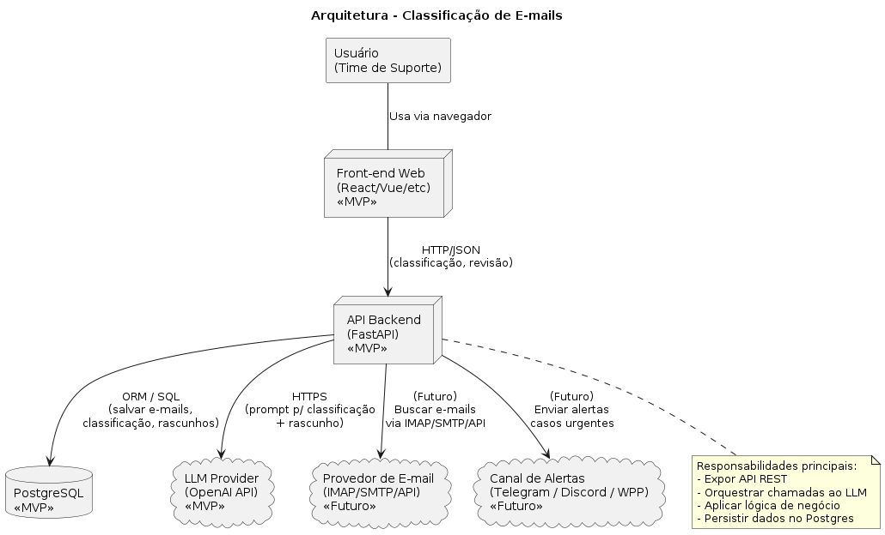
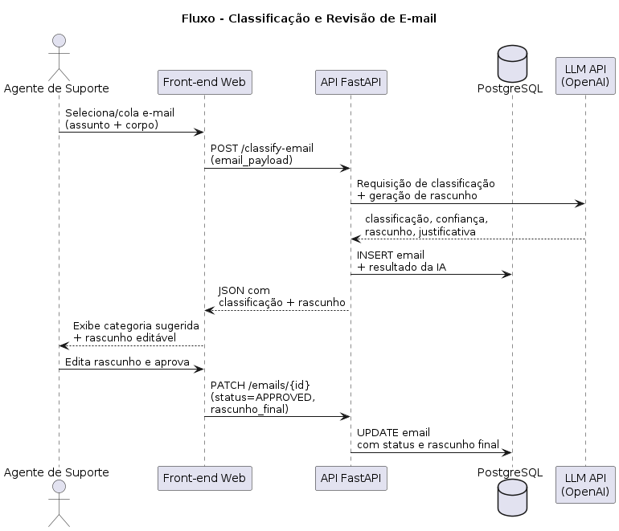
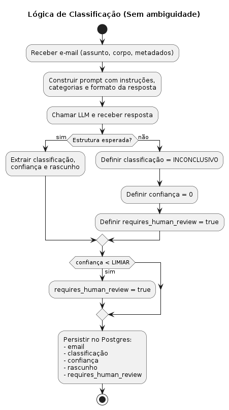
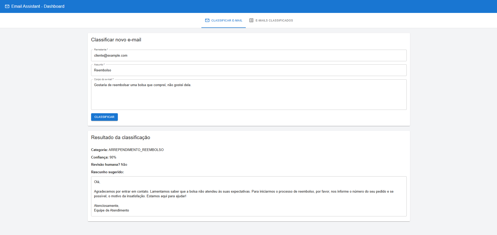
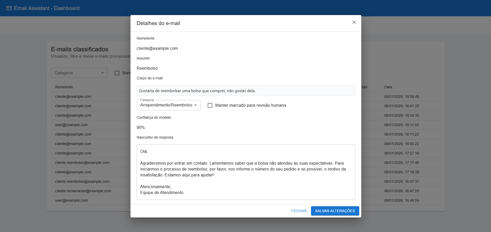
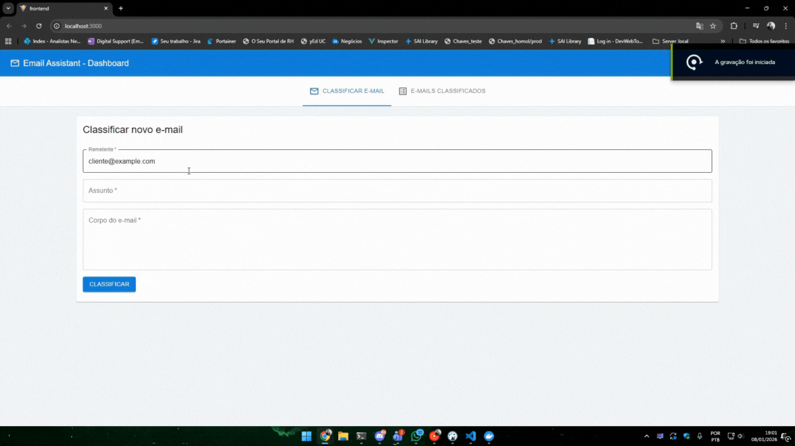

# 📧 Email Assistant – Technical Test

Sistema completo para **classificação inteligente de e-mails** utilizando **FastAPI + PostgreSQL + React + OpenAI GPT-4o**.  
Permite classificar, revisar, editar e listar e-mails com interface moderna e API bem estruturada.

---

## 🚀 Visão Geral

### 🔧 Backend (FastAPI)
- Integração com OpenAI GPT-4o para classificação
- SQLAlchemy + Alembic para ORM e migrations
- PostgreSQL para persistência
- Cliente LLM “dummy” automático caso não exista API key
- Estrutura em camadas (api/core/domain/infrastructure/services/schemas)

### 🎨 Frontend (React + Vite + Material UI)
- Tela de classificação de e-mails
- Tela de listagem com filtros
- Modal de detalhes/edição de e-mail
- Feedback visual (loading, snackbar, etc.)
- Comunicação com a API via Axios

### 🐳 Docker Compose
- Serviço `api` (backend)
- Serviço `db` (Postgres)
- Serviço `frontend` (React + Nginx)

---

## 📁 Estrutura do Projeto

    /
    ├── system/                # Backend (FastAPI)
    │   ├── app/
    │   │   ├── api/
    │   │   ├── core/
    │   │   ├── domain/
    │   │   ├── infrastructure/
    │   │   ├── services/
    │   │   ├── schemas/
    │   │   ├── .envExample
    │   │   └── main.py
    │   ├── migrations/
    │   ├── alembic.ini
    │   └── Dockerfile
    │
    ├── frontend/              # React App
    │   ├── src/
    │   ├── public/
    │   ├── nginx.conf
    │   ├── Dockerfile
    │   ├── .envExample
    │   └── vite.config.js
    │
    └── docker-compose.yml

---

## ⚙️ Configuração

### 🔒 Backend – `.env` (system/app/.env)

1. Copiar o exemplo:

    cp system/app/.envExample system/app/.env

2. Editar o arquivo `system/app/.env`:

    ENV=DEV  
    APP_NAME=Email Classification API  
    APP_VERSION=1.0.0  

    DATABASE_URL=postgresql+psycopg2://postgres:postgres@db:5432/email_db  

    OPENAI_API_KEY=sua-chave-aqui  
    OPENAI_MODEL=gpt-4o-mini  

⚠️ Importante: sem `OPENAI_API_KEY`, o backend utiliza um cliente de classificação “dummy” (as respostas não virão do modelo real da OpenAI).

---

### 🎨 Frontend – `.env` (frontend/.env)

1. Copiar o exemplo:

    cp frontend/.envExample frontend/.env

2. Conteúdo esperado:

    VITE_API_URL=http://localhost:8000

---

## 🐳 Como rodar com Docker (recomendado)

Subir todos os serviços:

    docker compose up --build

Acessos:

- API: http://localhost:8000  
- Swagger: http://localhost:8000/docs  
- Frontend: http://localhost:3000  
- PostgreSQL: localhost:5432

---

## 🧪 Rodar local (sem Docker)

### Backend

    python -m venv venv
    source venv/bin/activate
    pip install -r system/requirements.txt
    export $(cat system/app/.env | xargs)
    alembic -c system/alembic.ini upgrade head
    uvicorn system.app.main:app --reload

### Frontend

    cd frontend
    npm install
    npm run dev

---

## 📚 Endpoints Principais

| Método | Rota                      | Descrição                                      |
|--------|----------------------------|-----------------------------------------------|
| GET    | `/health/ping`             | Healthcheck da API                            |
| POST   | `/emails/classify`         | Classifica e persiste um novo e-mail          |
| GET    | `/emails`                  | Lista e-mails classificados                   |
| GET    | `/emails/{id}`             | Detalhes de um e-mail específico              |
| PUT    | `/emails/{id}`             | Atualiza categoria/rascunho/revisão humana    |

---

## 🧬 Diagramas (PlantUML)

Arquivos-fonte:

- `PlantUML/comp.puml` – Diagrama de componentes / arquitetura  
- `PlantUML/sequence.puml` – Fluxo de classificação (sequência)  
- `PlantUML/activity.puml` – Fluxo de atividade da solução  

---

## 📨 Exemplo de JSON para testes

    {
      "from_email": "cliente@exemplo.com",
      "subject": "Meu produto chegou quebrado",
      "body": "Recebi hoje e está danificado. Gostaria de solicitar troca."
    }

---

## 🖼️ Prints Sistema

### 📌 Tela de Classificação

### 📌 Listagem de E-mails

### 📌 Modal de Detalhes

### 🎥 Demonstração (GIF)

## 💡 Possíveis melhorias futuras

- Autenticação e controle de acesso
- Paginação de e-mails no backend
- Exportação de relatórios (CSV/Excel)
- Integração direta com IMAP/SMTP para leitura/envio real

---

## 📄 Licença

Projeto desenvolvido para avaliação técnica.  
Uso livre para estudo e referência.

---

## 👤 Autor

João Victor Dias Távora  